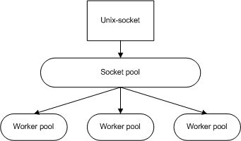

FastCGI-daemon is a multithreaded platform, designed to run FastCGI applications written in C++. Applications should be designed as a plug-ins using `libfastcgi-daemon2` which is a part of a project.

Daemon consists of some thread pools. One of them is a socket-pool which is responsible for interaction with HTTP-server, others run custom FastCGI-applications.

# Packages
The project is supporter on Linux Ubuntu (Hardy, Lucid � Precise).

|Package|Description|
|-----|--------|
|`fastcgi-daemon2`|Contains FastCGI-Daemon.|
|`fastcgi-daemon2-init`|Init-scripts for daemon.|
|`libfastcgi-daemon2`|Library needed to develop custom applications.|
|`libfastcgi-daemon2-dev`|Header files and static library `libfastcgi-daemon2.a`.|
|`libfastcgi2-syslog`|Application for daemon used to log into syslog.|
